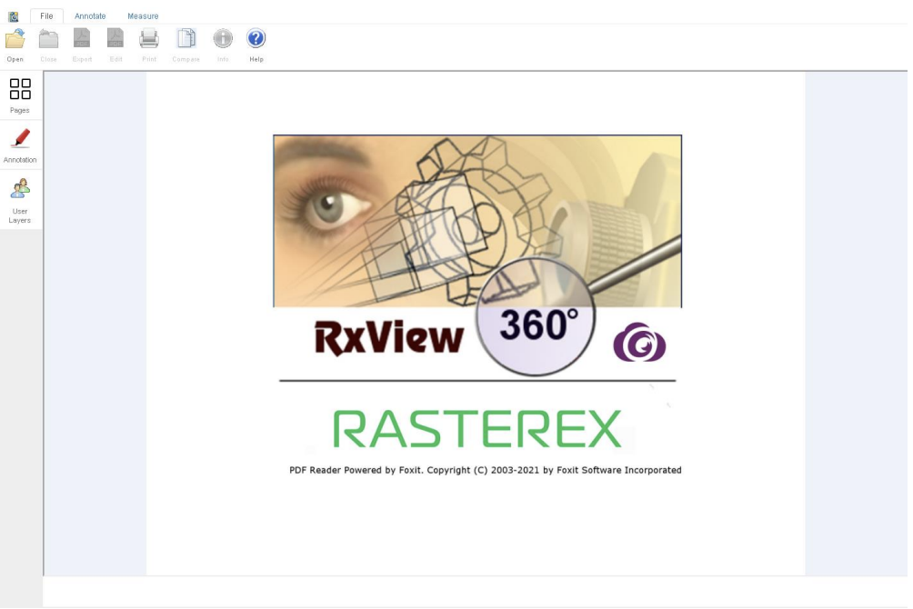

## Overview
RxView360 client consists of a single HTML page that acts as an independent complete viewer. The HTML page can be modified to customize the operation, with several functions available to operate on files and markup displayed in the viewer.

<!--  -->

# RxView360 Methods

The main JavaScript object is called RxCore and all following methods are referenced using RxCore.

### 2.1 `add3DViewAttribute`

Adds a custom attribute to a 3D view that is stored with the 3D markup data view.

<table>
  <tr>
    <th>Syntax</th>
    <td colspan="2">RxCore.add3DViewAttribute(atName, atValue, viewname)</td>
  </tr>
  <tr>
    <th>Parameters</th>
    <th>szName</th>
    <td>String – Name of the custom attribute</td>
  </tr>
  <tr>
    <th>Parameters</th>
    <th>szValue</th>
    <td>String – Value oft the custom attribute</td>
  </tr>
  <tr>
    <th>Parameters</th>
    <th>viewname</th>
    <td>String - Name of the view. The view name can be extracted from
any 3D annotation as the name property of the annotation.</td>
  </tr>
  <tr>
    <th>Returns</th>
    <td colspan="2">NA</td>
  </tr>
  <tr>
    <th>Example</th>
    <td colspan="2">RxCore.add3DViewAttribute("description", "my description", annotitem.name);
//annotitem is a valid 3D annotation object. </td>
  </tr>
</table>

### 2.1 `addFill`

To populate various fill styles to use with CAD polygons, use the addFill method.

