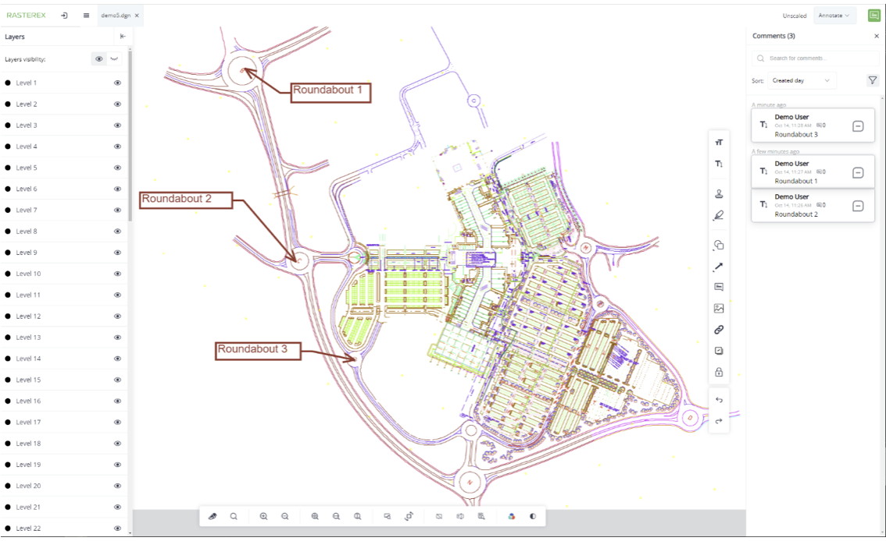

### Rasterex Web SDK viewer
The viewer is built using the Angular framework and is intended as a complete viewer that can demonstrate most of the Rasterex Web SDK current capabilities. The source for the viewer is freely available on our Github page. End users can modify and customize this viewer to suit their needs.

There are two versions of the Rasterex Web SDK

**Pro version** - Uses Foxit web SDK as the technology to display and handle PDF.

**Basic version** – Uses PDFJS as the technology to display and handle PDF.

### Github links

**Pro Version**  
[https://github.com/Rasterex-Software/Rasterex-Web-Viewer](https://github.com/Rasterex-Software/Rasterex-Web-Viewer)

**Basic Version**  
[https://github.com/Rasterex-Software/Rasterex-Web-Viewer-main-pdfjs](https://github.com/Rasterex-Software/Rasterex-Web-Viewer-main-pdfjs)

